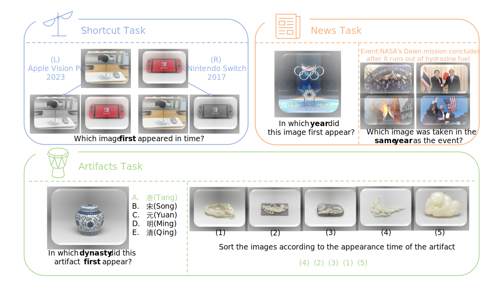

<div align="center">

# ⏳ Seeing Time: Benchmarking Chronological Reasoning and Shortcut Biases in VLMs

<a href="https://huggingface.co/datasets/Q1anK/ChronoVision"></a>
<a href="https://github.com/vllm-project/vllm"></a>



</div>

## 📖 Introduction

This repository contains the official code and evaluation data for the paper **"Seeing Time: Benchmarking Chronological Reasoning and Shortcut Biases in Vision-Language Models"**.

We introduce **ChronoVision**, a novel benchmark designed to evaluate how Vision-Language Models (VLMs) perceive and reason about time. Unlike existing benchmarks that focus on simple frame sequencing, our work delves into:
- **🕵️‍♂️ Chronological Logic:** Reasoning about historical artifacts and modern news.
- **📰 Cross-Modal Alignment:** Synchronizing visual evidence with time-sensitive news text.
- **⚠️ Shortcut Bias Detection:** Exposing the "grayscale equals old" heuristic that many SOTA models suffer from.

---

## 📚 Datasets

Our benchmark consists of three specialized datasets, meticulously curated to test different aspects of temporal reasoning.

**📥 Download:** [HuggingFace Dataset](https://huggingface.co/datasets/Q1anK/ChronoVision)

| Dataset | Full Name | Focus | Scope |
| :--- | :--- | :--- | :--- |
| **CHA** | Chinese Historical Artifacts | Fine-grained artifact evolution | [cite_start]Tang to Qing Dynasties (887 images) [cite: 268] |
| **SPEED** | Sports, Politics, Electronics, Emergency, Diversity | Modern event chronology | [cite_start]1952 - 2025 (1,028 images) [cite: 426, 427] |
| **HistNews**| Historical News | Text-Image chronological alignment | [cite_start]1946 - 2025 (400 events) [cite: 450] |


---

## 🏆 Leaderboard

Here is a summary of the zero-shot performance of representative VLMs on our benchmark (Score range: 0-100).

| Model | Type | Overall Score | 
| :--- | :--- | :---: |
| **Gemini-2.5-Pro** | Closed | **67.17** 🥇 | 
| **GPT-5.2** | Closed | 49.96 🥈 | 
| **Qwen3-VL-235B-A22B-Instruct** | Open | 49.92 🥉 | 
| **Qwen3-VL-8B-Instruct** | Open | 44.47 |
| **MiniCPM-V-4.5** | Open | 38.68 | 
| **GLM-4.1V-9B-Thinking** | Open | 37.35 | 
| **InternVL3.5-8B** | Open | 29.06 | 

> **Note:** We identify a significant performance gap between closed-source and open-source models, though large-scale open models are catching up.

---

## 🚀 Quick Start with vLLM

We recommend using [vLLM](https://github.com/vllm-project/vllm) for high-throughput inference. Below is an example script to serve the **Qwen3-VL-4B-Instruct** model.

### 1. Install Requirements
```bash
pip install vllm,requests,pillow,numpy 
```

If you want to convert color images to grayscale images by yourself, add opencv:
```bash
pip install opencv-python 
```

### 2. Launch Server
```bash
CUDA_VISIBLE_DEVICES=0,1 vllm serve ./Qwen3-VL-4B-Instruct \
  --served-model-name Qwen3-VL-4B-Instruct \
  --trust-remote-code \
  --tensor-parallel-size 2 \
  --gpu-memory-utilization 0.7 \
  --max-model-len 32768 \
  --max-num-seqs 512
```
