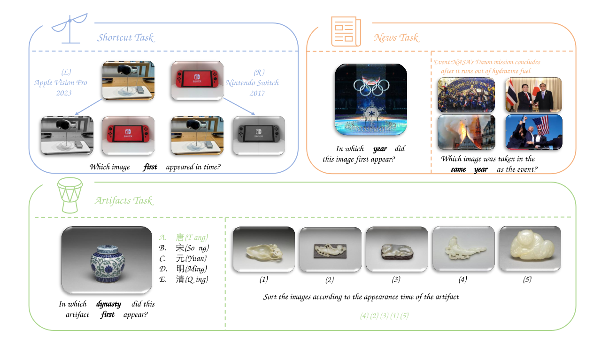

<div align="center">

# ⏳ Seeing Time: Benchmarking Chronological Reasoning and Shortcut Biases in VLMs

<a href="https://huggingface.co/datasets/Q1anK/ChronoVison_Dataset"></a>
<a href="https://github.com/vllm-project/vllm"></a>



</div>

## 📖 Introduction

This repository contains the official code and evaluation data for the paper **"Seeing Time: Benchmarking Chronological Reasoning and Shortcut Biases in Vision-Language Models"**.

We introduce **ChronoVision**, a novel benchmark designed to evaluate how Vision-Language Models (VLMs) perceive and reason about time. Unlike existing benchmarks that focus on simple frame sequencing, our work delves into:
- **🕵️‍♂️ Chronological Logic:** Reasoning about historical artifacts and modern news.
- **📰 Cross-Modal Alignment:** Synchronizing visual evidence with time-sensitive news text.
- **⚠️ Shortcut Bias Detection:** Exposing the "grayscale equals old" heuristic that many SOTA models suffer from.

---

## 📚 Datasets

Our benchmark consists of three specialized datasets, meticulously curated to test different aspects of temporal reasoning.

**📥 Download:** [HuggingFace Dataset](https://huggingface.co/datasets/Q1anK/ChronoVison_Dataset)

| Dataset | Full Name | Focus | Scope |
| :--- | :--- | :--- | :--- |
| **CHA** | Chinese Historical Artifacts | Fine-grained artifact evolution | Tang to Qing Dynasties (887 images) |
| **SPEED** | Sports, Politics, Electronics, Emergency, Diversity | Modern event chronology | 1952 - 2025 (1,028 images) |
| **HistNews**| Historical News | Text-Image chronological alignment | 1946 - 2025 (400 events)  |


---

## 🏆 Leaderboard

Here is a summary of the zero-shot performance of representative VLMs on our benchmark (Score range: 0-100).

| Model | Type | Overall Score | 
| :--- | :--- | :---: |
| **Gemini-2.5-Pro** | Closed | **67.17** 🥇 | 
| **GPT-5.2** | Closed | 49.96 🥈 | 
| **Qwen3-VL-235B-A22B-Instruct** | Open | 49.92 🥉 | 
| **Qwen3-VL-8B-Instruct** | Open | 44.47 |
| **MiniCPM-V-4.5** | Open | 38.68 | 
| **GLM-4.1V-9B-Thinking** | Open | 37.35 | 
| **InternVL3.5-8B** | Open | 29.06 | 

> **Note:** We identify a significant performance gap between closed-source and open-source models, though large-scale open models are catching up.

---

## 🚀 Quick Start with vLLM

We recommend using [vLLM](https://github.com/vllm-project/vllm) for high-throughput inference. Below is an example script to serve the **Qwen3-VL-4B-Instruct** model.

### 1. Install Requirements
```bash
pip install vllm,requests,pillow,numpy 
```

If you want to convert color images to grayscale images by yourself, add opencv:
```bash
pip install opencv-python 
```

### 2. Launch Server
```bash
CUDA_VISIBLE_DEVICES=0,1 vllm serve ./Qwen3-VL-4B-Instruct \
  --served-model-name Qwen3-VL-4B-Instruct \
  --trust-remote-code \
  --tensor-parallel-size 2 \
  --gpu-memory-utilization 0.7 \
  --max-model-len 32768 \
  --max-num-seqs 512
```
### 3. Start benchmarking

The **test & ans** folder displays the image and text locations required for each set of tests in all tasks. 

After restoring the tests, use the test scripts in the **code** folder

## Specific Task Results and Analysis

### Artifacts-Chronological Localization Task Performance
| Model                       | Fan (102) | Carving (109) | Coin (119) | Lacq. (104) | China (221) | Jade (222) | Total ACC |
| --------------------------- | --------: | ------------: | ---------: | ----------: | ----------: | ---------: | --------: |
| **Closed-Source**           |           |               |            |             |             |            |           |
| Gemini-2.5-Pro              |     44.12 |         46.73 |      49.58 |       26.92 |       55.66 |      36.94 |     44.23 |
| GPT-5.2                     |     47.06 |         40.37 |      43.70 |       46.15 |       44.80 |      27.48 |     40.14 |
| **Closed-Source Average**   |     45.59 |         43.55 |      46.64 |       36.54 |       50.23 |      32.21 |     42.19 |
| **Open-Source**             |           |               |            |             |             |            |           |
| InternVL-3.5-8B             |     11.76 |         31.19 |      31.93 |       25.96 |       29.41 |      18.92 |     24.86 |
| MiniCPM-V-4.5               |     45.10 |         50.46 |      44.54 |       62.50 |       51.13 |      27.93 |     44.93 |
| GLM-4.1V-9B-Thinking        |     35.29 |         38.53 |      26.27 |       49.04 |       47.51 |      24.77 |     36.53 |
| Qwen2.5-VL-7B-Instruct      |     49.02 |         50.46 |      57.98 |       45.19 |       48.42 |      26.13 |     44.01 |
| Qwen3-VL-2B-Instruct        |     26.47 |         27.52 |      15.97 |       41.35 |       30.77 |      18.02 |     25.88 |
| Qwen3-VL-4B-Instruct        |     41.18 |         42.20 |      44.54 |       43.27 |       45.70 |      29.28 |     40.14 |
| Qwen3-VL-8B-Instruct        |     38.24 |         41.28 |      43.70 |       50.00 |       44.80 |      22.52 |     38.43 |
| Qwen3-VL-235B-A22B-Instruct |     57.84 |         55.05 |      65.55 |       55.77 |       52.94 |      29.73 |     49.94 |
| **Open-Source Average**     |     38.11 |         42.09 |      41.31 |       46.64 |       43.84 |      24.66 |     38.09 |
| **Total Average**           |     39.61 |         42.38 |      42.38 |       44.62 |       45.11 |      26.17 |     38.91 |

### Artifacts-Sort Task Performance
| Model             | China (250) | Jade (250) | Mixed (500) |
| ----------------- | ----------: | ---------: | ----------: |
| **Closed-Source** |             |            |             |
| Gemini-2.5        |        0.49 |       0.08 |        0.28 |
| GPT-5.2           |        0.38 |       0.07 |        0.27 |
| **Average**       |        0.44 |       0.07 |        0.27 |
| **Open-Source**   |             |            |             |
| InternVL-3.5      |        0.13 |      -0.01 |        0.12 |
| MiniCPM-4.5       |        0.17 |       0.07 |        0.10 |
| GLM-4.1V          |        0.19 |       0.12 |        0.22 |
| Qwen2.5-7B        |        0.21 |       0.08 |        0.13 |
| Qwen3-2B          |        0.12 |       0.02 |        0.06 |
| Qwen3-4B          |        0.29 |       0.06 |        0.15 |
| Qwen3-8B          |        0.37 |       0.09 |        0.23 |
| Qwen3-235B        |        0.40 |       0.09 |        0.25 |
| **Average**       |        0.24 |       0.06 |        0.16 |
| **Total Average** |        0.28 |       0.07 |        0.18 |

### Shortcut Task: Detailed Performance and Bias Sensitivity
| Model                       | Sports ACC_B | Sports ΔACC | Politics ACC_B | Politics ΔACC | Electronics ACC_B | Electronics ΔACC | Emergency ACC_B | Emergency ΔACC | Diversity ACC_B | Diversity ΔACC |
| --------------------------- | -----------: | ----------: | -------------: | ------------: | ----------------: | ---------------: | --------------: | -------------: | --------------: | -------------: |
| **Closed-Source**           |              |             |                |               |                   |                  |                 |                |                 |                |
| Gemini-2.5-Pro              |        79.50 |       11.50 |          87.00 |          6.50 |             90.00 |             6.00 |           79.50 |          12.00 |           90.75 |          10.25 |
| GPT-5.2                     |        71.00 |       45.50 |          74.00 |         25.50 |             87.00 |             3.50 |           64.50 |          47.00 |           82.75 |          27.75 |
| **Closed-Source Average**   |        75.25 |       28.50 |          80.50 |         16.00 |             88.50 |             4.75 |           72.00 |          29.50 |           86.75 |          19.00 |
| **Open-Source**             |              |             |                |               |                   |                  |                 |                |                 |                |
| InternVL3.5-8B              |        55.50 |       88.50 |          62.00 |         83.50 |             74.00 |            28.00 |           50.50 |          82.50 |           73.75 |          55.75 |
| MiniCPM-V-4.5               |        64.00 |       70.00 |          68.00 |         68.50 |             81.00 |             5.50 |           61.00 |          61.50 |           77.25 |          37.00 |
| GLM-4.1V-9B-Thinking        |        54.00 |       91.00 |          65.50 |         79.50 |             77.00 |            24.50 |           58.00 |          73.00 |           75.75 |          37.75 |
| Qwen2.5-VL-7B-Instruct      |        60.50 |       71.00 |          62.00 |         62.00 |             77.00 |            10.50 |           57.50 |          49.50 |           69.75 |          32.00 |
| Qwen3-VL-2B-Instruct        |        39.50 |       39.50 |          43.00 |         32.50 |             72.50 |             5.50 |           35.00 |          29.50 |           62.25 |          19.75 |
| Qwen3-VL-4B-Instruct        |        58.00 |       48.50 |          62.00 |         41.00 |             88.00 |             5.00 |           51.00 |          46.00 |           77.25 |          32.00 |
| Qwen3-VL-8B-Instruct        |        70.50 |       35.50 |          72.00 |         38.50 |             86.50 |            21.50 |           67.00 |          34.00 |           81.25 |          26.00 |
| Qwen3-VL-235B-A22B-Instruct |        71.00 |       53.00 |          74.00 |         29.50 |             87.50 |             3.00 |           65.50 |          54.00 |           84.50 |          25.50 |
| **Open-Source Average**     |        59.13 |       62.13 |          63.56 |         54.38 |             80.44 |            12.94 |           55.69 |          53.75 |           75.22 |          33.22 |
| **Total Average**           |        62.35 |       55.40 |          66.95 |         46.70 |             82.05 |            11.30 |           58.95 |          48.90 |           77.53 |          30.38 |

### Shorcut Task Acorss Semantic Domains
| Domain      | ACC_B | ACC_1 | ACC_2 |  ΔACC |
| ----------- | ----: | ----: | ----: | ----: |
| Sports      | 62.35 | 86.45 | 31.05 | 55.40 |
| Politics    | 66.95 | 85.15 | 38.45 | 46.70 |
| Electronics | 82.05 | 85.40 | 74.10 | 11.30 |
| Emergency   | 58.95 | 81.45 | 32.55 | 48.90 |
| Diversity   | 77.53 | 84.13 | 53.75 | 30.38 |

### News-Years Task Performance
| Model                       | Sports ACC | Sports MAE | Politics ACC | Politics MAE | Electronics ACC | Electronics MAE | Emergency ACC | Emergency MAE | Diversity ACC | Diversity MAE |
| --------------------------- | ---------: | ---------: | -----------: | -----------: | --------------: | --------------: | ------------: | ------------: | ------------: | ------------: |
| **Closed-Source**           |            |            |              |              |                 |                 |               |               |               |               |
| Gemini-2.5-Pro              |      62.75 |       1.36 |        62.84 |         0.98 |           33.33 |            2.77 |         54.94 |          2.30 |         59.80 |          2.03 |
| GPT-5.2                     |      42.48 |       4.40 |        42.62 |         2.60 |           45.73 |            1.95 |         40.74 |          4.08 |         37.16 |          4.33 |
| **Closed-Source Average**   |      52.62 |       2.88 |        52.73 |         1.79 |           39.53 |            2.36 |         47.84 |          3.19 |         48.48 |          3.18 |
| **Open-Source**             |            |            |              |              |                 |                 |               |               |               |               |
| InternVL-3.5-8B             |      15.69 |      12.11 |        13.66 |        10.69 |           27.35 |            5.29 |          4.94 |         19.77 |          9.46 |         13.37 |
| MiniCPM-V-4.5               |      36.60 |       3.46 |        34.43 |         2.33 |           39.32 |            2.03 |         30.86 |          3.59 |         23.99 |          4.31 |
| GLM-4.1V-9B-Thinking        |      37.25 |       6.22 |        31.15 |         3.22 |           41.45 |            2.73 |         38.27 |          5.40 |         28.72 |          6.52 |
| Qwen2.5-VL-7B-Instruct      |      45.10 |       4.16 |        34.43 |         2.08 |           29.06 |            2.61 |         33.95 |          3.04 |         31.08 |          4.09 |
| Qwen3-VL-2B-Instruct        |      28.76 |       3.24 |        32.24 |         2.17 |           34.62 |            2.27 |         27.78 |          3.54 |         22.97 |          4.67 |
| Qwen3-VL-4B-Instruct        |      32.03 |       2.86 |        34.43 |         1.98 |           40.60 |            1.79 |         33.33 |          3.17 |         28.38 |          4.29 |
| Qwen3-VL-8B-Instruct        |      38.56 |       4.39 |        39.89 |         1.84 |           41.45 |            1.88 |         25.31 |          4.40 |         34.80 |          3.75 |
| Qwen3-VL-235B-A22B-Instruct |      47.06 |       2.05 |        49.18 |         1.12 |           44.87 |            2.26 |         45.06 |          2.61 |         52.36 |          2.47 |
| **Open-Source Average**     |      35.13 |       4.81 |        33.68 |         3.18 |           37.34 |            2.61 |         29.94 |          5.69 |         28.97 |          5.43 |
| **Total Average**           |      38.63 |       4.43 |        37.49 |         2.90 |           37.78 |            2.56 |         33.52 |          5.19 |         32.87 |          4.98 |

### News-Multimodal Task Performance
| Model             | Sports | Politics | Elec. | Emer. | Dive. |
| ----------------- | -----: | -------: | ----: | ----: | ----: |
| **Closed-Source** |        |          |       |       |       |
| Gemini-2.5        |  86.00 |    87.20 | 72.80 | 80.00 | 89.80 |
| GPT-5.2           |  42.80 |    56.40 | 56.40 | 45.20 | 48.80 |
| **Average**       |  64.40 |    71.80 | 64.60 | 62.60 | 69.30 |
| **Open-Source**   |        |          |       |       |       |
| InternVL-3.5      |  36.00 |    41.20 | 52.40 | 40.00 | 32.20 |
| MiniCPM-4.5       |  19.60 |    25.60 | 25.20 | 28.00 | 26.00 |
| GLM-4.1V          |  39.60 |    36.00 | 47.20 | 31.60 | 37.60 |
| Qwen2.5           |   8.40 |    14.40 |  8.80 | 13.20 | 15.00 |
| Qwen3-2B          |  20.80 |    26.00 | 22.00 | 32.00 | 25.40 |
| Qwen3-4B          |  28.80 |    31.60 | 21.20 | 24.00 | 26.20 |
| Qwen3-8B          |  27.20 |    28.40 | 22.40 | 24.00 | 27.40 |
| Qwen3-235B        |  25.60 |    32.40 | 36.00 | 36.40 | 36.20 |
| **Average**       |  25.75 |    29.45 | 29.40 | 28.65 | 28.25 |
| **Total Average** |  33.48 |    37.92 | 36.44 | 35.44 | 36.46 |
